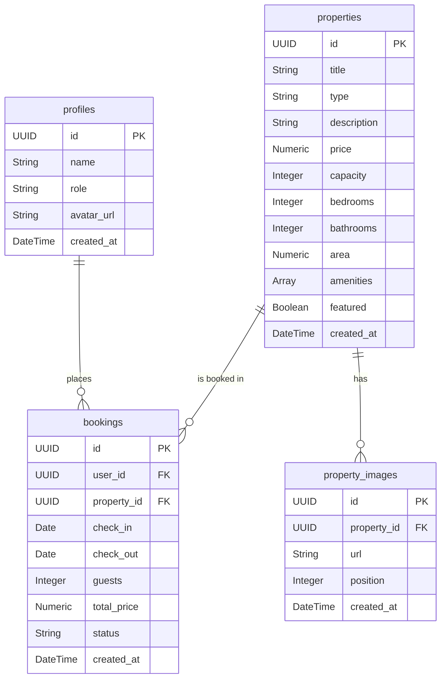
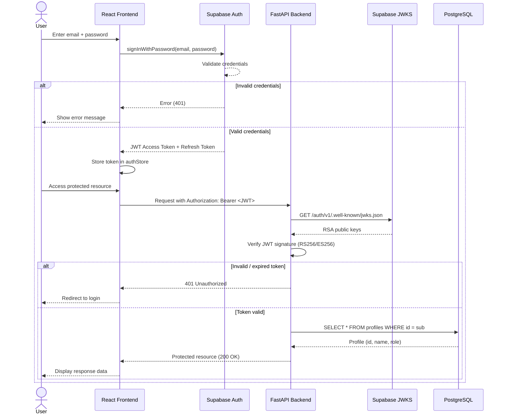
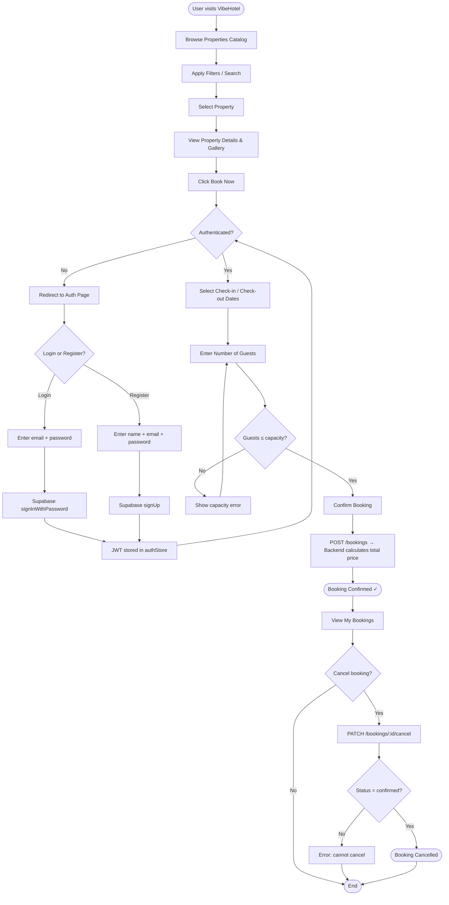

# VibeHotel — System Diagrams

---

## 1. Структура бази даних (Database Structure)

```mermaid
erDiagram
    profiles {
        UUID id PK
        String name
        String role
        String avatar_url
        DateTime created_at
    }

    properties {
        UUID id PK
        String title
        String type
        String description
        Numeric price
        Integer capacity
        Integer bedrooms
        Integer bathrooms
        Numeric area
        Array amenities
        Boolean featured
        DateTime created_at
    }

    property_images {
        UUID id PK
        UUID property_id FK
        String url
        Integer position
        DateTime created_at
    }

    bookings {
        UUID id PK
        UUID user_id FK
        UUID property_id FK
        Date check_in
        Date check_out
        Integer guests
        Numeric total_price
        String status
        DateTime created_at
    }

    profiles ||--o{ bookings : "places"
    properties ||--o{ bookings : "is booked in"
    properties ||--o{ property_images : "has"
```

---

## 2. Authorization Code Flow

```mermaid
sequenceDiagram
    actor User
    participant Frontend as React Frontend
    participant SupabaseAuth as Supabase Auth
    participant Backend as FastAPI Backend
    participant JWKS as Supabase JWKS
    participant DB as PostgreSQL

    User->>Frontend: Enter email + password
    Frontend->>SupabaseAuth: signInWithPassword(email, password)
    SupabaseAuth-->>SupabaseAuth: Validate credentials
    alt Invalid credentials
        SupabaseAuth-->>Frontend: Error (401)
        Frontend-->>User: Show error message
    else Valid credentials
        SupabaseAuth-->>Frontend: JWT Access Token + Refresh Token
        Frontend->>Frontend: Store token in authStore

        User->>Frontend: Access protected resource
        Frontend->>Backend: Request with Authorization: Bearer <JWT>
        Backend->>JWKS: GET /auth/v1/.well-known/jwks.json
        JWKS-->>Backend: RSA public keys
        Backend->>Backend: Verify JWT signature (RS256/ES256)
        alt Invalid / expired token
            Backend-->>Frontend: 401 Unauthorized
            Frontend-->>User: Redirect to login
        else Token valid
            Backend->>DB: SELECT * FROM profiles WHERE id = sub
            DB-->>Backend: Profile (id, name, role)
            Backend-->>Frontend: Protected resource (200 OK)
            Frontend-->>User: Display response data
        end
    end
```

---

## 3. Activity Diagram — Booking Flow

```mermaid
flowchart TD
    Start([User visits VibeHotel]) --> Browse[Browse Properties Catalog]
    Browse --> Filter[Apply Filters / Search]
    Filter --> Select[Select Property]
    Select --> Details[View Property Details & Gallery]
    Details --> TryBook[Click Book Now]

    TryBook --> IsAuth{Authenticated?}

    IsAuth -- No --> AuthPage[Redirect to Auth Page]
    AuthPage --> AuthChoice{Login or Register?}
    AuthChoice -- Login --> Login[Enter email + password]
    AuthChoice -- Register --> Register[Enter name + email + password]
    Login --> SupabaseSignIn[Supabase signInWithPassword]
    Register --> SupabaseSignUp[Supabase signUp]
    SupabaseSignIn --> TokenStored[JWT stored in authStore]
    SupabaseSignUp --> TokenStored
    TokenStored --> IsAuth

    IsAuth -- Yes --> Dates[Select Check-in / Check-out Dates]
    Dates --> Guests[Enter Number of Guests]
    Guests --> Validate{Guests ≤ capacity?}
    Validate -- No --> GuestsError[Show capacity error]
    GuestsError --> Guests
    Validate -- Yes --> Confirm[Confirm Booking]
    Confirm --> PostBooking[POST /bookings → Backend calculates total price]
    PostBooking --> BookingOK([Booking Confirmed ✓])

    BookingOK --> MyBookings[View My Bookings]
    MyBookings --> CancelDecision{Cancel booking?}
    CancelDecision -- No --> End([End])
    CancelDecision -- Yes --> Cancel[PATCH /bookings/:id/cancel]
    Cancel --> StatusCheck{Status = confirmed?}
    StatusCheck -- No --> CancelError[Error: cannot cancel]
    CancelError --> End
    StatusCheck -- Yes --> Cancelled([Booking Cancelled])
    Cancelled --> End
```
